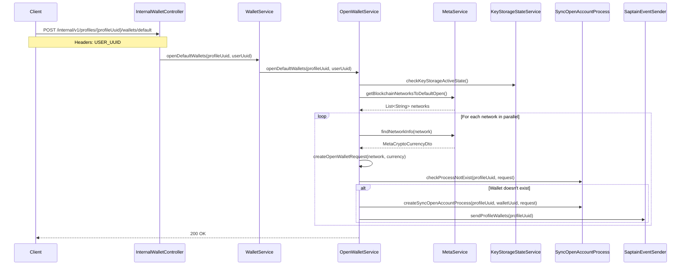

# OpenDefaultWallets Flow Documentation

This document describes the flow of the `openDefaultWallets` method in the `InternalWalletApi` implementation.

## Overview

The `openDefaultWallets` method is responsible for creating default cryptocurrency wallets for a user's profile across supported blockchain networks. It creates wallets for the main currency of each supported network in parallel.

## Flow Diagram

## Key Components

1. **InternalWalletController**: Entry point for the API endpoint
2. **WalletService**: Orchestrates the wallet operations
3. **OpenWalletService**: Core service handling wallet creation
4. **MetaService**: Provides blockchain network and currency information
5. **KeyStorageStateService**: Validates key storage state
6. **SyncOpenAccountProcess**: Manages wallet creation process state
7. **SaptainEventSender**: Notifies about wallet changes

## Supported Networks

The service supports multiple blockchain networks (defined in `Networks.java`):
- Bitcoin
- Ethereum
- Tron
- Polygon

## Process Flow

1. Client calls the endpoint with profile UUID and user UUID
2. System validates key storage state
3. Retrieves list of default networks to open from MetaService
4. For each network (in parallel):
   - Gets network information (main currency)
   - Creates wallet request with UUID
   - Checks for existing wallet
   - Creates sync process for wallet creation
   - Sends wallet update event
5. Returns success response

## Error Handling

- Validates key storage state before processing
- Checks for existing wallets to prevent duplicates
- Validates process existence for each wallet creation
- Handles network-specific currency requirements 