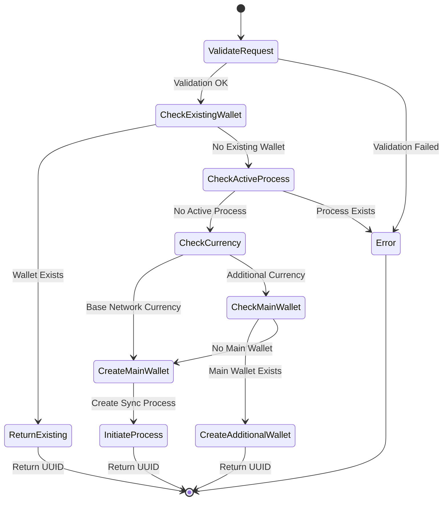

# Wallet Creation Workflow

This document describes the workflow of creating a new wallet through the `POST /public/v1/profiles/{profileUuid}/wallets` endpoint.

## Overview

The wallet creation process is implemented as a state machine that ensures atomic creation of wallets and associated accounts. The process handles both main network currency wallets and additional currency wallets for the same blockchain network.

## API Endpoint

```http
POST /public/v1/profiles/{profileUuid}/wallets
Content-Type: application/json
X-User-Uuid: {userUuid}

{
    "uuid": "UUID",
    "blockchainNetwork": "string",
    "currencyCode": "string"
}
```

Implementation: [`WalletController.java`](../operation-app/src/main/java/com/saptain/operation/app/controller/WalletController.java)

## Workflow Diagram



## Implementation Details
    
### Core Components

1. **Controller Layer**
   - [`WalletController`](../operation-app/src/main/java/com/saptain/operation/app/controller/WalletController.java): Handles HTTP requests
   - Entry point: `openWallet(UUID profileUuid, UUID userUuid, OpenWalletRequest request)`

2. **Service Layer**
   - [`OpenWalletService`](../operation-app/src/main/java/com/saptain/operation/app/service/wallet/OpenWalletService.java): Main orchestrator
   - [`AdditionalWalletService`](../operation-app/src/main/java/com/saptain/operation/app/service/wallet/AdditionalWalletService.java): Handles additional currency wallets
   - [`SyncOpenAccountProcessService`](../operation-app/src/main/java/com/saptain/operation/app/service/wallet/SyncOpenAccountProcessService.java): Manages wallet creation process

### Workflow Steps

1. **Request Validation**
   ```java
   validateOpenWalletRequest(userUuid, profileUuid, request);
   ```
   - User permission check for the profile
   - Currency and blockchain network validation
   - User consent verification (private policy and terms of use)
   - Key storage state verification

2. **Existing Wallet Check**
   ```java
   cryptoWalletRepository.findActiveCryptoWallet(
       profileUuid,
       request.getBlockchainNetwork(),
       request.getCurrencyCode(),
       CoaCode.PROVIDER_STAKING_COA_CODES
   );
   ```
   - Returns existing wallet UUID if found
   - Continues to creation if not found

3. **Process Creation**
   - For main network currency wallets:
     - Creates `SYNC_OPEN_ACCOUNT` state machine process
     - Generates necessary UUIDs
     - Creates wallet and GL accounts
   - For additional currency wallets:
     - Reuses existing main wallet's address
     - Creates only necessary additional accounts

### Database Schema

Key tables involved in wallet creation:

1. **CryptoWallet**
   - Stores wallet information
   - Links to profile and blockchain network
   - Maintains currency and address information

2. **Process**
   - Manages state machine for wallet creation
   - Tracks creation status and errors
   - Stores process metadata

### Error Handling

The implementation includes comprehensive error handling:

1. **Transaction Safety**
   - Uses `@Transactional` annotations
   - Ensures atomic operations
   - Handles rollbacks on failures

2. **Validation Errors**
   - Profile permissions
   - Currency/network configurations
   - User consents
   - Key storage availability

3. **Process Conflicts**
   - Checks for existing active processes
   - Prevents duplicate wallet creation
   - Handles race conditions

### Event Notifications

The system sends notifications at key points:

1. **Wallet Creation Events**
   - Notifies dependent systems
   - Updates user profile status
   - Triggers necessary callbacks

2. **GL Account Events**
   - Notifies accounting systems
   - Updates balance tracking
   - Maintains audit trail

## Related Documentation

- [State Machine Documentation](state-machine)
- [Operation Service Overview](home) 