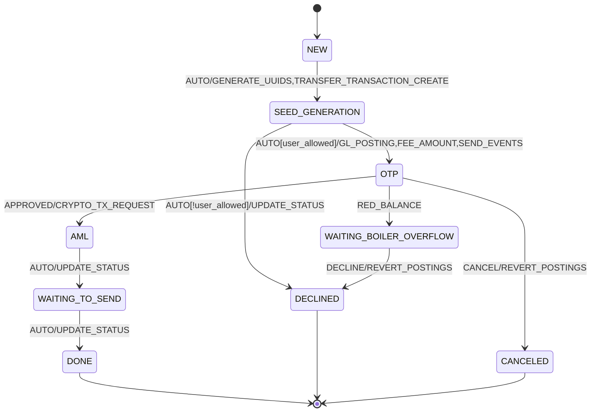
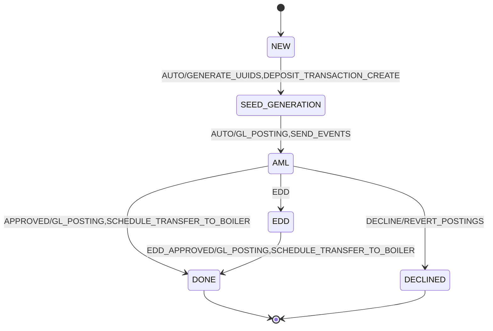

# Operation State Machine

The Operation service uses a flexible state machine implementation to handle various types of operations like transfers, deposits, and other cryptocurrency transactions. The state machine is implemented using the [stateless4j](https://github.com/oxo42/stateless4j) library.

## Implementation Details

The state machine implementation is located in the following key files:

- [`StateMachineService.java`](../operation-app/src/main/java/com/saptain/operation/app/service/statemachine/StateMachineService.java): Core service that handles state transitions and event processing
- [`StateMachineSchema.java`](../operation-app/src/main/java/com/saptain/operation/app/data/StateMachineSchema.java): Schema definition class
- [`Process.java`](../operation-app/src/main/java/com/saptain/operation/app/repository/entity/Process.java): Entity that stores the current state and schema

The state machine configurations are stored in SQL scripts under `operation-app/src/main/resources/scripts-runalways/` with names like `TRANSFER-state_machine.sql`, `DEPOSIT-state_machine.sql`, etc.

## Key Concepts

1. **States**: Represented by `OperationStateMachineState` enum
2. **Events**: Represented by `OperationStateMachineEvent` enum
3. **Actions**: Business logic executed during transitions
4. **Guards**: Conditions that must be met for transitions to occur

## Core Operation Flows

### Transfer Operation

The transfer operation represents a cryptocurrency transfer between wallets.



Key stages:
1. **SEED_GENERATION**: Generates UUIDs and creates initial transaction records
2. **OTP**: Requires user verification via OTP
3. **AML**: Anti-Money Laundering checks
4. **WAITING_TO_SEND**: Waiting for blockchain transaction
5. **DONE/DECLINED/CANCELED**: Terminal states

### Deposit Operation

The deposit operation handles incoming cryptocurrency deposits.



Key stages:
1. **SEED_GENERATION**: Initial setup and transaction creation
2. **AML**: Anti-Money Laundering verification
3. **EDD**: Enhanced Due Diligence (if required)
4. **DONE/DECLINED**: Terminal states

## Common Components

### Actions
Common actions across operations include:
- GL_POSTING: Handles accounting entries
- SEND_EVENT: Sends notifications
- TRANSACTION_STATUS_UPDATE: Updates transaction status
- BPM_BALANCE_CHANGE: Notifies about balance changes

### Guards
Guards are used for:
- User operation permissions
- AML checks
- Balance validations

## Database Schema

The state machine data is stored in two main tables:
1. `process`: Stores individual process instances with their current state
2. `state_machine`: Stores the state machine definitions

Key columns in `process`:
```sql
create table "process" (
    "id" bigserial primary key,
    "uuid" uuid unique not null,
    "name" text not null,
    "schema" jsonb not null,
    "data" jsonb not null,
    "state" text not null,
    -- ... other columns
);
```

## Error Handling

The state machine implementation includes comprehensive error handling:
1. Transaction retries (via `@Retryable`)
2. Error state tracking
3. Automatic rollback of GL postings on failure
4. Detailed error logging 